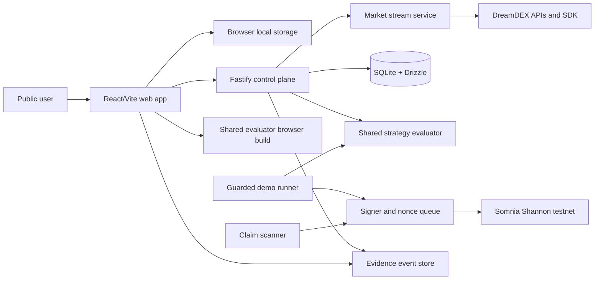

# EventPilot

## Build it. Simulate it. Prove it on-chain.

**EventPilot** is a no-wallet strategy policy studio and public evidence console for DreamDEX Event Contracts. It lets a user design a risk-limited BTC or ETH strategy, understand exactly why it would or would not act, simulate decisions against live markets, and verify the same strategy artifact executing on Somnia Shannon testnet.

### Hackathon profile

| Item | Decision |
|---|---|
| Hackathon | Somnia x DreamDEX Event Contracts Hackathon |
| Product | EventPilot |
| Network | Somnia Shannon testnet, chain ID 50312 |
| Core integration | DreamDEX Event Contracts and `@somnia-chain/markets-sdk` |
| Development workflow | OpenSpec `spec-driven` workflow committed to the repository |
| Public access | No wallet required for market discovery, strategy building, paper decisions, or evidence viewing |
| Funded writes | Dedicated, low-balance server-side testnet wallet only |
| Internal submission target | September 7, 2026 |
| License | MIT |

## 1. Executive summary

Most users who want to automate an Event Contract strategy must write and operate a bot, manage a signing key, understand tick and lot grids, track market rollovers, handle stale indexer data, and reconcile transactions and claims. That creates a large gap between having a simple trading rule and safely demonstrating it on-chain.

EventPilot closes that gap with one coherent workflow:

1. Discover live BTC and ETH Event Contracts.
2. Build a versioned strategy policy visually.
3. Preview every guard and exact order bound before any write.
4. Run a browser-local decision simulation without a wallet.
5. Inspect a public testnet runner executing the same canonical strategy.
6. Follow the evidence chain from strategy hash to market snapshot, decision, transaction receipt, fill state, finalization, and claim.

The project is intentionally not an AI forecaster, copy-trading product, profitability engine, or mainnet bot. Its innovation is the combination of a portable deterministic policy, explainable execution decisions, and independently verifiable on-chain evidence.

## 2. Problem

DreamDEX Event Contracts make fixed-window directional markets available on an on-chain order book, but automation still creates several barriers:

- A simple rule requires custom bot code and infrastructure.
- Protocol precision and lifecycle behavior are easy to misunderstand.
- Users often cannot tell why an automated system acted or skipped.
- Paper demos frequently imply fills or returns that were never possible to verify.
- A live hackathon demo can fail because of wallet setup, market rollover, liquidity, or settlement timing.
- A transaction link alone does not prove which strategy and snapshot produced the action.

The result is low trust and unnecessary friction for developers, judges, and potential users.

## 3. Solution

EventPilot turns strategy automation into a reviewable policy and evidence workflow.

### 3.1 Live Markets

The application discovers current DreamDEX Event Contracts dynamically and presents:

- BTC or ETH and the market interval.
- Strike and expiry.
- YES and NO best bid and ask.
- Market-implied probabilities.
- Absolute and relative spread.
- Executable depth.
- On-chain lifecycle status.
- Data age and expiry countdown.

The interface explicitly handles stale data, empty books, market rollover, locked markets, finalized markets, and connection recovery.

### 3.2 Strategy Studio

A guided builder creates a versioned `StrategyV1` without requiring a wallet. A strategy contains:

- Asset and interval selector.
- YES or NO outcome.
- Trigger comparator and threshold.
- Separate maximum entry price.
- Maximum spread and minimum time remaining.
- Maximum snapshot age and minimum executable depth.
- IOC quantity and maximum collateral.
- Orders-per-market, daily collateral, cooldown, and execution-failure limits.

The builder validates incompatible or unsafe settings immediately and renders a plain-English policy preview.

### 3.3 Deterministic Evaluator

The shared evaluator receives:

```text
StrategyV1 + MarketSnapshotV1 + RiskSnapshotV1 + EvaluationTime
```

and returns a `DecisionV1` containing:

- Eligibility.
- Every passing and failing guard.
- Market and venue identifiers.
- Snapshot source block and timestamp.
- Exact price ticks and raw price.
- Exact quantity lots and raw quantity.
- Maximum raw collateral cost.
- Decision validity and expiry.
- Canonical strategy hash and intent key.

The same evaluator is used by browser paper runs and by the funded testnet runner, so the public demonstration is not a separate implementation.

### 3.4 Paper Run

The browser-local paper runner continuously evaluates live snapshots and records a decision timeline. It reports `would submit at this snapshot`, not guaranteed fills or invented profit. No wallet is connected, no key is requested, and no live transaction is sent.

### 3.5 Guarded Demo Runner

A dedicated control-plane worker consumes an operator-approved `StrategyV1` and can submit tightly bounded IOC orders on Shannon testnet. The runner:

- Starts in dry-run mode.
- Hard-fails on any chain other than 50312.
- Re-checks on-chain `Trading` status immediately before a write.
- Rejects stale snapshots.
- Uses exact bigint tick and lot arithmetic.
- Caps expiry at market expiry.
- Explicitly verifies transaction receipt success.
- Serializes orders and claims through one signer queue.
- Persists an idempotency intent before sending.
- Reconciles uncertain or in-flight transactions after restart.
- Scans finalized markets and claims eligible outcomes.

The public site cannot arm, stop, or modify the funded runner.

### 3.6 Evidence Console

The evidence console makes the demonstration auditable. For each runner action it shows:

```text
strategy hash
-> market snapshot
-> deterministic decision
-> persisted intent
-> transaction hash
-> receipt result
-> fill or unfilled result
-> market finalization
-> claim transaction
```

Explorer links are included for all on-chain writes. Failed and reverted actions remain visible rather than being hidden.

## 4. Why this is differentiated

DreamDEX already provides bot examples and several strategy patterns. EventPilot therefore does not compete on the claim that it is the first automated Event Contract bot. Its defensible differentiation is:

1. **Policy as a portable product artifact** - a canonical, versioned strategy can be exported, imported, hashed, reviewed, and executed by different runners.
2. **One evaluator across simulation and execution** - the same deterministic engine powers the visual preview, paper timeline, and live runner.
3. **Decision explainability** - every guard is observable and testable, including the exact tick, lot, maximum cost, data freshness, and risk state.
4. **Evidence instead of claims** - a strategy hash is linked to the snapshot, decision, receipt, fill state, and claim.
5. **No-wallet onboarding** - a judge or new user can experience the full decision workflow without obtaining test tokens or approving transactions.
6. **Open self-hosting path** - exported strategies can later be consumed by a self-hosted testnet runner without turning the hosted product into a custodial service.

## 5. OpenSpec as a first-class project system

OpenSpec remains in the repository for the entire project. The default `spec-driven` schema produces a proposal, testable capability specs, a technical design, and dependency-ordered tasks before implementation starts.

The project commits:

```text
openspec/config.yaml
openspec/specs/
openspec/changes/
.agents/skills/openspec-*/
```

OpenSpec governs all user-visible behavior, protocol integration, risk controls, authentication, persistence, and deployment changes. The required lifecycle is:

```text
explore -> propose -> review -> apply -> verify -> archive
```

The hackathon repository will retain archived changes so judges can inspect not only the final code but also the intent, decisions, acceptance scenarios, and implementation history.

## 6. MVP scope

### P0: mandatory submission scope

- Dynamic live BTC and ETH Event Contract discovery.
- Current order-book and lifecycle display.
- Guided `StrategyV1` builder.
- Deterministic, exact-arithmetic evaluator.
- Browser-local decision timeline.
- Strategy JSON export/import and canonical hash.
- Shannon-only dry-run and IOC execution path.
- At least one explorer-verifiable DreamDEX testnet write.
- Public evidence console.
- Read-only public deployment with no wallet requirement.
- README, architecture diagram, tests, SDK feedback report, and two-to-three-minute demo video.

### P1: high-value completion scope

- Durable restart reconciliation and duplicate-intent protection.
- Automated finalized-market scan and claim evidence.
- Cursor-backed SSE event history.
- Self-hosted runner command for exported strategies.
- Judge Mode with a prepared strategy and last verified run.

### Explicit non-goals

- Mainnet writes.
- Custom Solidity contracts.
- Generative AI or price prediction claims.
- User-controlled hosted wallets.
- Guaranteed fills, profit projections, or backtested return marketing.
- Advanced portfolio optimization.
- More assets or market intervals unless already exposed by the official Event Contract integration.
- Multi-region or horizontally scaled execution workers.

## 7. Technical architecture



### Monorepo

```text
apps/
|-- web/                  React, Vite, Tailwind, accessible components
`-- control-plane/        Fastify API, market stream, runner, claim worker
packages/
|-- strategy/             schemas, evaluator, risk ledger, canonical hashing
|-- dreamdex-adapter/     normalized reads, exact writes, receipt verification
|-- contracts/            shared API and event schemas, not Solidity
`-- test-fixtures/         deterministic snapshots and receipt fixtures
openspec/                  specifications, active changes, archive
```

### Primary technology choices

- TypeScript with strict compiler settings.
- pnpm workspaces.
- React and Vite for a small, client-first no-wallet interface.
- Tailwind and accessible headless components.
- TanStack Query for request state.
- Fastify for the control plane.
- Server-Sent Events for normalized market and runner events.
- SQLite with Drizzle on a persistent Railway volume.
- One runner process and one signer queue.
- Vitest for unit and integration tests.
- Playwright for judge-critical desktop and mobile flows.
- Vercel for the public web app and Railway for the single-instance control plane.
- `@somnia-chain/markets-sdk` pinned to `0.28.1` for the sprint, with the lockfile committed.

## 8. Protocol invariants

The implementation must preserve the following invariants:

1. Market and venue identifiers are discovered from current data; pool addresses are not treated as durable identities.
2. State is keyed by `marketId` and strategy hash.
3. The chain, not the indexer, is authoritative for a write decision.
4. Only on-chain status `Trading` is eligible for an order.
5. Snapshots older than the configured freshness bound are rejected.
6. Price and quantity conversion uses integer ticks and lots only.
7. Buy-price snapping cannot exceed the configured maximum entry price.
8. Quantity snapping cannot exceed configured quantity or collateral.
9. EventPilot strategy orders are IOC only.
10. Every order has an expiry no later than market expiry.
11. A resolved SDK write is not considered successful until its receipt is explicitly checked.
12. One signer queue serializes orders and claims.
13. An idempotency intent is durable before transaction submission.
14. Restart reconciliation occurs before new intents are allowed.
15. Claims scan binary markets with status `Finalized`.
16. The runner defaults to `DRY_RUN=true` and refuses non-Shannon writes.
17. Private keys never cross an API boundary.

## 9. Suggested initial guard defaults

These are conservative product defaults, not claims about normal liquidity. They can be adjusted after collecting testnet snapshots.

| Guard | 15-minute market | 1-hour market |
|---|---:|---:|
| Soft spread warning | 150 probability bps | 100 probability bps |
| Hard spread limit | 300 probability bps | 200 probability bps |
| Minimum time remaining | 180 seconds | 720 seconds |
| Maximum snapshot age | 3 seconds | 3 seconds |
| Maximum collateral per order | 1 to 5 test USDso | 1 to 5 test USDso |
| Orders per market | 1 | 1 |

The allowed spread should also be capped relative to the selected outcome mid-price so low-probability outcomes cannot pass an unreasonably wide absolute spread.

## 10. Public API

```text
GET  /v1/health
GET  /v1/markets
GET  /v1/markets/stream
POST /v1/evaluations
GET  /v1/demo-runner
GET  /v1/demo-runner/events?cursor=...
GET  /v1/evidence/:intentId
PUT  /v1/admin/strategy
POST /v1/admin/runner/arm
POST /v1/admin/runner/stop
```

Admin endpoints require a server-validated operator token, strict origin controls, rate limiting, audit logging, and constant-time token comparison. The normal public browser never receives the token.

## 11. User experience

### Screen 1: Live Markets

Market cards show asset, interval, strike, implied probabilities, bid/ask, spread, depth, on-chain status, data age, and expiry. The user can open a market snapshot inspector.

### Screen 2: Strategy Studio

A guided sequence captures selector, trigger, entry cap, market guards, order size, and risk limits. Immediate validation explains conflicts, and a plain-English preview updates on every change.

### Screen 3: Paper Run

A live decision timeline displays eligible and skipped evaluations with exact reasons. The user can pause, resume, clear, export, and import browser-local sessions.

### Screen 4: Demo Runner

A public read-only view displays the active strategy hash, health, risk budget, last snapshot, last decision, order intents, receipts, fills, failures, finalized markets, and claims.

### Screen 5: Evidence

A single intent page links the strategy, snapshot, decision, transaction, receipt, fill state, market lifecycle, and claim. Judge Mode opens a prepared evidence example even if the current live book is empty.

### Required states

- Initial loading.
- No active market.
- Empty order book.
- Stale data.
- Disconnected stream.
- Reconnecting stream.
- Market rolled to a new ID.
- Market locked or finalized.
- Risk guard blocked.
- Unfilled IOC.
- Partial fill.
- Reverted receipt.
- Unknown receipt pending reconciliation.
- Runner stopped.
- Claim unavailable.
- Claim confirmed.

## 12. Hackathon judging alignment

| Criterion | EventPilot evidence |
|---|---|
| Innovation and originality - 20% | Portable strategy policy, deterministic explainability, strategy hash, and complete evidence chain rather than another signal bot |
| Technical implementation - 25% | Live Event Contract discovery, SDK integration, exact tick/lot arithmetic, on-chain status gating, IOC execution, receipt verification, restart idempotency, and claims |
| UX and design - 20% | No-wallet onboarding, guided builder, human-readable decisions, responsive layouts, accessibility, and explicit recovery states |
| Business and ecosystem impact - 20% | Reduces the gap between idea and testnet automation, creates exportable policies, enables self-hosting, and gives new developers reusable integration patterns |
| Presentation and demo - 15% | A deterministic flow from live market to policy to paper decision to verified testnet evidence, supported by Judge Mode |

## 13. Delivery plan

### August 28-29: protocol truth

- Initialize monorepo, OpenSpec, CI, environment validation, and secret redaction.
- Pin the SDK and commit the lockfile.
- Prove dynamic market and venue discovery.
- Read live books and lifecycle state.
- Normalize snapshots and test market rollover.

### August 30-31: strategy truth

- Finalize `StrategyV1`, `MarketSnapshotV1`, `RiskSnapshotV1`, and `DecisionV1`.
- Implement exact tick, lot, and cost arithmetic.
- Add boundary, property, and stale-data tests.
- Implement canonical JSON and strategy hashing.

### September 1-2: product experience

- Build Live Markets and Strategy Studio.
- Add browser-local paper sessions and decision timeline.
- Add SSE reconnect, cursor history, responsive flows, and accessibility states.

### September 3-4: on-chain evidence

- Implement the Shannon-only signer queue and IOC path.
- Add receipt verification, durable intents, and restart reconciliation.
- Add finalized-market claim scanning.
- Populate the evidence console and explorer links.

### September 5: feature freeze

- Freeze new capabilities.
- Complete deployment, recovery testing, security review, and clean-checkout validation.

### September 6-7: submission

- Complete README, architecture diagram, SDK feedback report, and judging instructions.
- Record the two-to-three-minute video.
- Tag the release and submit on September 7 to preserve deadline margin.

## 14. Demo script

### 0:00-0:20 - problem

Show that a simple Event Contract rule normally requires bot code, wallet operations, and protocol-specific safeguards.

### 0:20-0:45 - live market

Open a current BTC or ETH market. Highlight market ID, on-chain `Trading` status, implied probability, spread, freshness, and expiry.

### 0:45-1:15 - build policy

Choose an outcome, trigger, maximum entry price, spread limit, time limit, and collateral cap. Show the plain-English policy and canonical strategy hash.

### 1:15-1:40 - explain decision

Run `Evaluate now`. Show each passing and failing guard plus exact ticks, lots, and maximum cost.

### 1:40-2:00 - paper timeline

Start the browser-local paper run. Show skipped and eligible decisions without claiming profit or guaranteed fills.

### 2:00-2:35 - verified testnet execution

Open the public runner and a confirmed evidence item produced by the same strategy hash. Follow the transaction to the Somnia explorer and show receipt and fill state.

### 2:35-2:50 - lifecycle and claim

Show the finalized-market scanner and a claim record, or clearly show the claim path and most recent verified claim if the current market has not finalized.

### 2:50-3:00 - future

Show strategy export and describe the self-hosted runner path.

## 15. Ecosystem and product path

EventPilot can evolve from a hackathon product into open infrastructure for strategy authors and automation operators:

- Portable policy templates shared by URL or JSON.
- Community strategy galleries that show rules rather than unverifiable performance claims.
- Self-hosted personal runners.
- Team review and approval workflows based on strategy hashes.
- Historical decision replay with honest execution assumptions.
- SDK integration examples derived from tested adapters.
- Policy compatibility with other binary Event Contract markets.

The hosted project remains non-custodial and read-only for public users unless a later security-reviewed architecture is introduced.

## 16. Risks and mitigations

| Risk | Mitigation |
|---|---|
| Live book has no fillable liquidity during judging | Judge Mode uses a previously verified transaction; live evaluation still demonstrates current integration |
| Indexer lags chain | Reject stale snapshots and re-check on-chain status before writes |
| Market rolls during an evaluation | Key by market ID, expire decisions quickly, and re-evaluate after rollover |
| SDK write resolves after revert | Explicitly inspect receipt success before recording completion |
| Duplicate order after restart | Persist unique intent before send and reconcile SENT or UNKNOWN records first |
| Signer nonce collision | One process and one signer queue for orders and claims |
| Scope exceeds sprint | P0/P1 separation and September 5 feature freeze |
| Public admin credential exposure | Keep operator controls private or CLI-only; never bundle a token |
| Paper mode appears to promise fills | Use `would submit` language and display model limitations |
| Deadline timezone ambiguity | Final submission target is September 7, one day early |

## 17. Submission deliverables

- Public GitHub repository.
- Working Shannon testnet prototype.
- Public no-wallet web experience.
- At least one explorer-verifiable DreamDEX Event Contract write.
- Two-to-three-minute demo video.
- SDK and documentation feedback report.
- README with setup, architecture, protocol integration, risk model, limitations, and exact judging path.
- OpenSpec proposal, specs, design, tasks, and archived implementation changes.
- Release tag and license.
- Optional presentation deck.

## 18. DoraHacks copy

### One-line pitch

EventPilot lets anyone build and simulate a risk-limited DreamDEX Event Contract strategy, then verify the same policy executing on Somnia testnet.

### Short description

EventPilot is a no-wallet strategy policy studio and evidence console for DreamDEX Event Contracts. Users discover live BTC and ETH markets, build a deterministic risk policy, inspect every execution guard, and run browser-local paper decisions. A constrained server-side runner executes the same hashed strategy on Somnia Shannon testnet and publishes the complete evidence chain from snapshot and decision to transaction receipt, fill state, finalization, and claim.

### What makes it innovative

Instead of hiding automation behind opaque signals, EventPilot makes the strategy itself portable, versioned, deterministic, and auditable. The browser simulator and testnet runner share one evaluation engine, and every on-chain action is tied to a strategy hash and exact market snapshot.

### Technical highlights

- Live DreamDEX Event Contract market discovery.
- `@somnia-chain/markets-sdk` integration.
- Exact bigint tick and lot arithmetic.
- On-chain lifecycle gating and stale-data rejection.
- IOC-only bounded execution.
- Receipt verification and durable idempotency.
- Serialized order and claim writes.
- Finalized-market claim scanning.
- SSE monitoring and public explorer evidence.
- OpenSpec-driven requirements, design, tasks, verification, and archive.

## 19. Success criteria

The submission is accepted internally only when:

- Fresh checkout install, typecheck, test, and production build succeed.
- The public no-wallet path works on desktop and mobile.
- A strategy can be created, validated, exported, imported, and evaluated.
- Paper decisions never send a transaction.
- The runner refuses mainnet and starts dry.
- At least one DreamDEX testnet write has a verified receipt and explorer link.
- No key or sensitive token is present in source, logs, browser bundles, fixtures, or the database.
- The evidence console links the strategy hash to the decision and transaction result.
- The README gives judges a path that takes less than three minutes.
- OpenSpec strict validation and implementation verification pass.

## 20. References

- Somnia x DreamDEX hackathon: https://dorahacks.io/hackathon/event-contracts/detail
- DreamDEX: https://www.dreamdex.io/
- DreamDEX Event Contracts documentation: https://docs.dreamdex.io/developers/event-contracts
- DreamDEX Bot Kit: https://github.com/somnia-chain/dreamdex-bot-kit
- Somnia network information: https://docs.somnia.network/developer/network-info/network-overview-mainnet-testnet
- OpenSpec: https://openspec.dev/
- OpenSpec quickstart: https://openspec.dev/docs/quickstart
